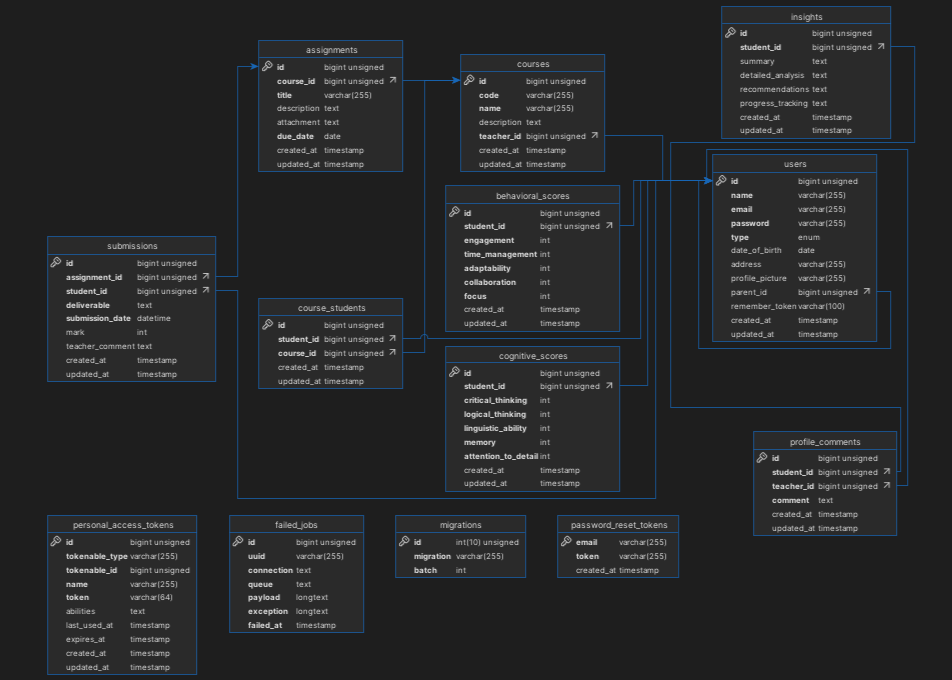
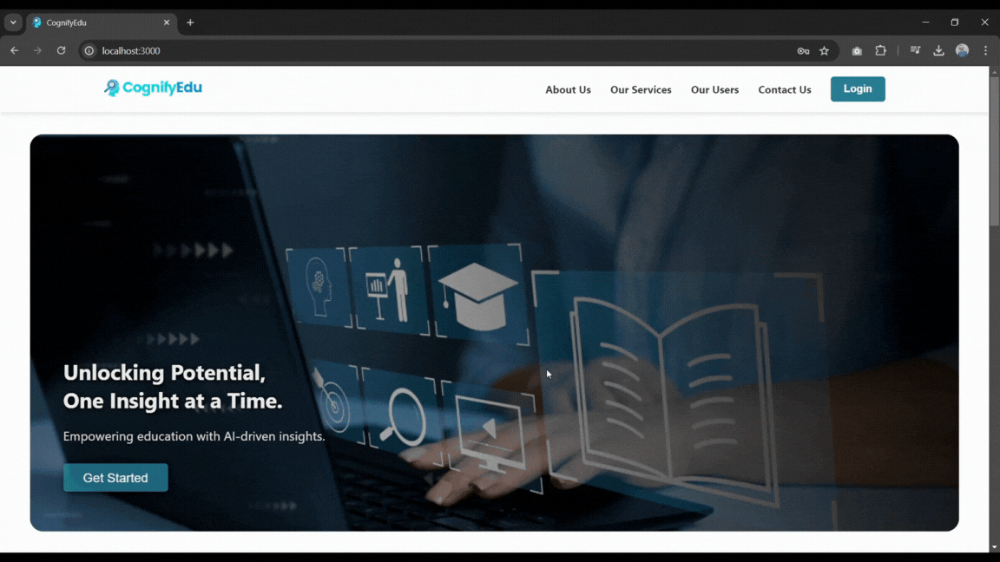
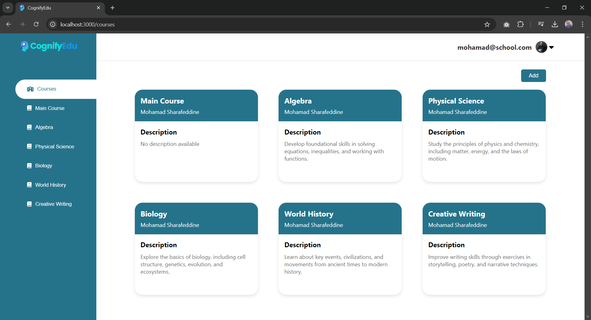
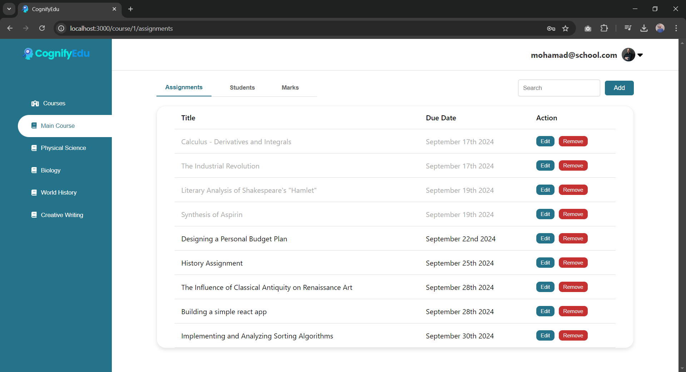
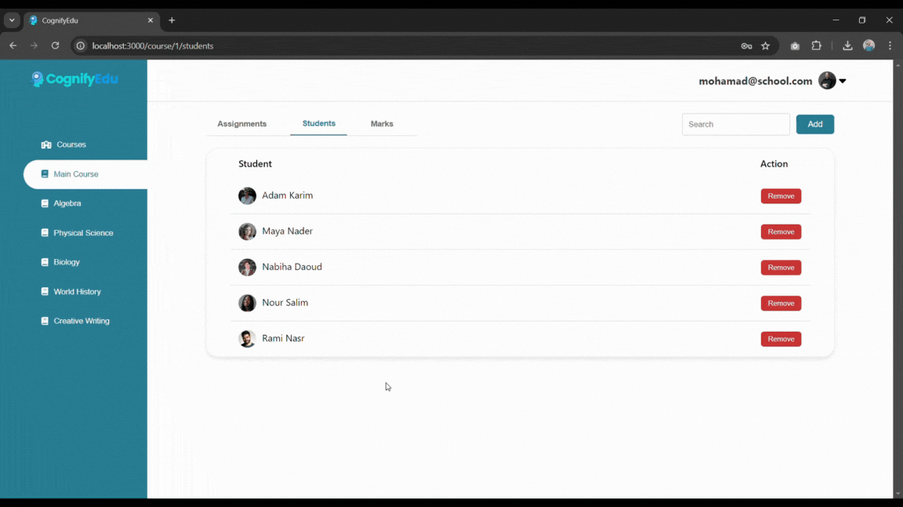
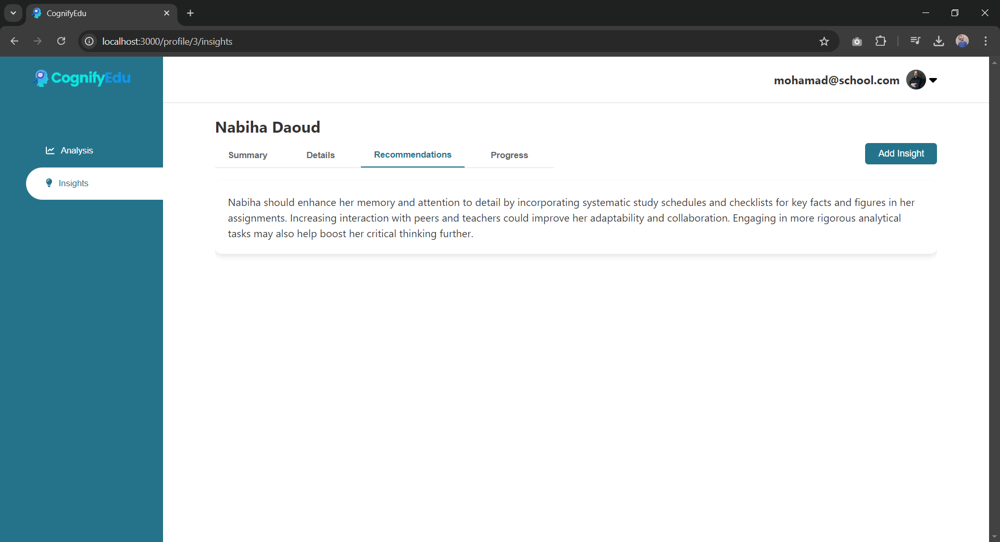
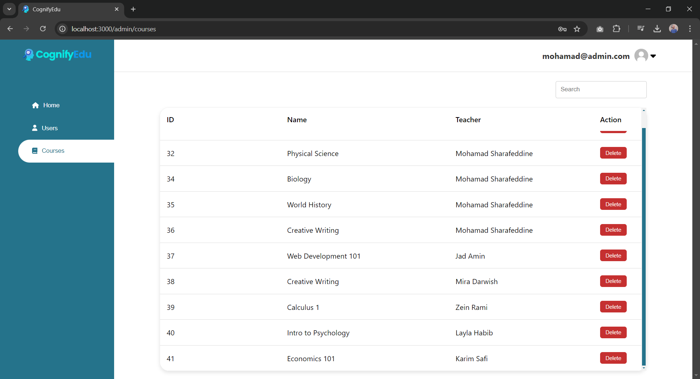
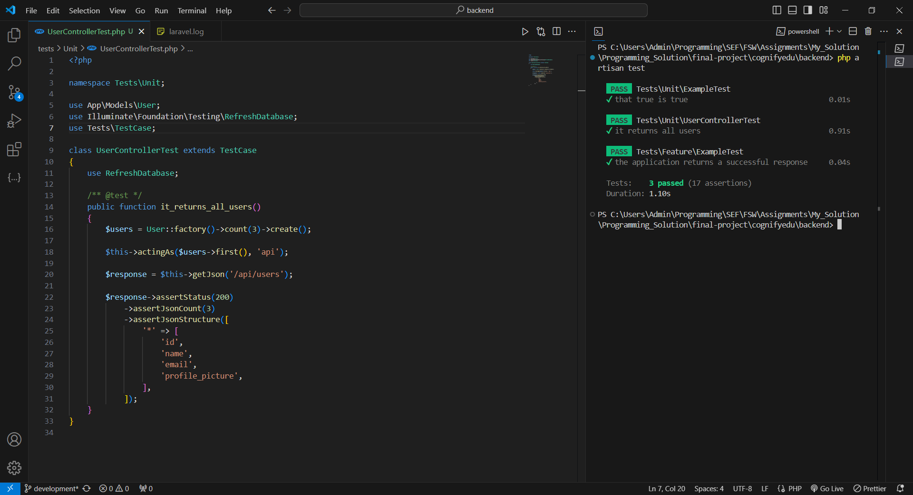

<br><br>

<!-- project philosophy -->


> An AI-driven educational platform that provides cognitive and behavioral insights by integrating academic performance with psychological assessments to enhance student development.
>
> CognifyEdu aims to streamline the learning process by providing a user-friendly platform for managing assignments, tracking student progress, and offering insightful cognitive and behavioral data. We believe in enhancing the educational experience by empowering teachers, students, and parents with meaningful insights to foster student growth and development.

### User Stories

#### Teacher
- As a teacher, I want to create and assign assignments, so I can track student progress and provide feedback.
- As a student, I want to receive personalized learning paths, so I can focus on my strengths and areas for improvement.

#### Student
- As a student, I want to submit my assignments, so I can complete tasks and receive feedback on my performance.
- As a student, I want to receive personalized learning paths, so I can focus on my strengths and areas for improvement.

#### Parent
- As a parent, I want to understand my child’s abilities and development, so I can support their learning at home effectively.
- As a parent, I want to view my child’s cognitive and behavioral insights, so I can monitor their academic and personal development.

#### Admin
- As an admin, I want to view and manage all users, so I can oversee platform activities and ensure smooth operation.
- As an admin, I want to view and manage courses, so I can ensure the platform’s educational content is up to date and properly organized.

<br><br>

<!-- Tech stack -->


### CognifyEdu is built using the following technologies:

- This project uses the [React.js](https://reactjs.org/) framework for building the user interface. React is a JavaScript library for creating dynamic, responsive web applications.
- For the backend, the project uses the [Laravel](https://laravel.com/) PHP framework, which provides a robust structure for API management, authentication, and database interactions.
- The platform stores data in a [MySQL](https://www.mysql.com/) database, which is ideal for managing relational data such as student profiles, assignments, and grades.
- To provide AI-driven cognitive and behavioral insights, the platform integrates with the [OpenAI API] (https://openai.com/) for advanced data processing.
- The platform is deployed and hosted on [AWS](https://aws.amazon.com/) for scalable and secure cloud infrastructure.

<br><br>

<!-- UI UX -->


> We designed CognifyEdu using wireframes and mockups, iterating on the design until we reached the ideal layout for easy navigation and a seamless user experience.

- Project [Figma](https://www.figma.com/design/U2P8bXvDJkAEcWznBTxUUh/UI-UX-Assignments?node-id=257-428&t=CbqzlIepZUG9RqWT-1) design

<!-- ### Mockups

| Home screen                               | Menu Screen                             | Order Screen                            |
| ----------------------------------------- | --------------------------------------- | --------------------------------------- |
|  |  |  | -->

<br><br>

<!-- Database Design -->


### Architecting Data Excellence: Innovative Database Design Strategies:



<br><br>

<!-- Implementation -->


### User Screens

| Landing Screen                            | Login Popup                             |
| ----------------------------------------- | --------------------------------------- |
|  |  |
| Courses Screen                            | Course Screen                           |
|  |  |
| Analysis Screen                           | Insights Screen                         |
|  |  |

### Admin Screens

| Users Screen                              | Courses Screen                          |
| ----------------------------------------- | --------------------------------------- |
|  |  |
<br><br>

<!-- Prompt Engineering -->


### Mastering AI Interaction: Unveiling the Power of Prompt Engineering:

- This project uses advanced prompt engineering techniques to optimize interactions with the OpenAI API. By carefully crafting the input prompts, we tailor the cognitive and behavioral assessments to deliver precise insights that enhance the academic development of students.

<br><br>

<!-- AWS Deployment -->


### Efficient AI Deployment: Unleashing the Potential with AWS Integration:

- This project leverages AWS deployment strategies to seamlessly integrate and scale the CognifyEdu platform. AWS ensures that our AI-driven educational insights are delivered efficiently and securely to support a wide range of users.

<br><br>

<!-- Unit Testing -->


### Precision in Development: Harnessing the Power of Unit Testing:

- This project employs comprehensive unit testing methodologies to ensure the accuracy and reliability of all components in CognifyEdu. By systematically testing individual parts of the platform, we maintain a strong foundation, quickly identifying and addressing issues to provide a stable learning experience.


<br><br>

<!-- How to run -->


> To set up CognifyEdu locally, follow these steps:

### Prerequisites

Make sure you have the following installed:

- npm
  ```sh
  npm install npm@latest -g
  ```
- Composer
  ```sh
  composer install
  ```

### Installation

Follow these steps to install and set up CognifyEdu locally:

1. Get an API Key at [OpenAI](https://beta.openai.com/signup/)
2. Clone the repo
   git clone [github](https://github.com/MohamadSharafeddine/cognifyedu.git)
3. Navigate to the backend directory and install Composer packages
   ```sh
   cd backend
   composer install
   ```
4. Add your API key to the .env file
   ```env
   OPENAI_API_KEY="ENTER YOUR OPENAI API KEY"
   ```
5. Navigate to the frontend directory and install NPM packages
   ```sh
   cd ../frontend
   npm install
   ```
6. Start the development server
   ```sh
   npm start
   ```

Now, you should be able to run CognifyEdu locally and explore its features.
